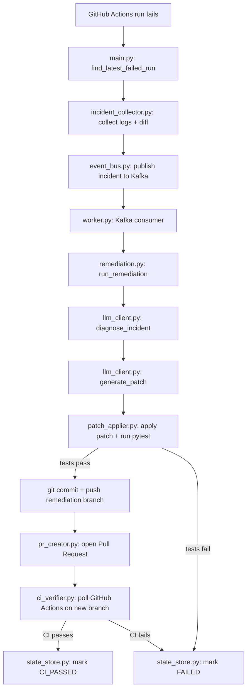

# Teaching a CI Pipeline to Fix Itself — Without Trusting It Blindly

Every developer knows the moment: CI goes red, and now you're the one who has to stop, dig through logs, find the actual error, and patch it by hand. I got tired of that loop, so I built a system that does the first part of the job for me — and the story worth telling isn't "an AI that reads logs." It's how I stopped that AI from lying to me.

## What the System Does

I built a CI/CD intelligence agent: a background worker that watches this repository's own GitHub Actions runs. When a run fails, it doesn't just flag the failure — it diagnoses it, writes a fix, proves the fix works, and opens a pull request with that proof attached.

The full loop looks like this:

- Detect a failed GitHub Actions run
- Collect the evidence: logs, the failing step, the commit diff
- Send that evidence to an LLM to diagnose the root cause
- Have the LLM propose the smallest possible patch
- Apply the patch to a new branch
- Run the real test suite locally
- Only if tests pass, push the branch and open a pull request
- Poll GitHub Actions on that new branch and confirm it's actually green

There's a Streamlit dashboard sitting on top of this that shows every incident's current stage — detected, diagnosing, patch generated, tests passed, PR created, CI verified — along with the AI's stated root cause, its suggested fix, and a risk/confidence score.

Architecturally, the system is a handful of small, single-purpose pieces wired together with Kafka and Redis:



Detection and remediation are split across a Kafka topic (`ci-incidents`) instead of one function calling another directly. That's a deliberate decoupling: the code that notices a failure doesn't need to know anything about how the fix gets made. It just publishes an event and moves on. The worker consumes it whenever it's ready. That separation is also what let me add more incident sources, or run multiple workers, without touching the detection side at all.

## The Real Problem: Getting an LLM to Stop Guessing

Anyone can point an LLM at a stack trace and ask it to "fix it." The output looks plausible. Sometimes it's even right. The problem is the other times — when the model invents a root cause that isn't in the logs, or edits a file that had nothing to do with the failure, and you don't find out until it's already merged. The real question isn't "can a model read a stack trace." It's how you constrain it so it only acts on evidence in front of it, and only ships changes it can prove are safe.

My answer: never let the model's opinion be the last word. Every fix has to pass two independent, mechanical gates before anyone sees it.

**Gate one — local proof.** After the LLM generates a patch, `patch_applier.py` applies it to a real file and immediately runs the actual test suite with `pytest`. Not a summary, not the model's self-assessment — the same test command a human would run. If it fails, the incident is marked `FAILED` and nothing goes further. No PR, no notification claiming a fix exists. The loop just stops.

**Gate two — real CI proof.** Passing tests locally isn't enough, because "works on my machine" is exactly the failure mode this system exists to prevent. So once the patch passes locally, the worker pushes it to a `remediation/` branch, opens a pull request, and then polls GitHub Actions itself. Only when GitHub's own runner reports success does the incident get marked `CI_PASSED`. If it fails here, it routes back to the same `FAILED` state as a local test failure.

The entry point that kicks this whole thing off is intentionally boring, and I think that's a feature:

```python
from app.incident_collector import (
    find_latest_failed_run,
    get_failed_incident,
)
from app.event_bus import publish_incident


failed_run = find_latest_failed_run()

run_id = failed_run["id"]
branch = failed_run["head_branch"]

incident = get_failed_incident(run_id)

event = publish_incident(
    incident,
    branch,
)

print("Kafka topic: ci-incidents")
print("Run ID:", event["run_id"])
print("Branch:", event["branch"])
```

Nothing in `main.py` knows about LLMs, patches, or pull requests. It has exactly one job: turn a GitHub Actions failure into a structured event. `find_latest_failed_run` also explicitly skips any run on a `remediation/` branch, so the agent doesn't end up diagnosing its own fix attempts as new incidents. Small detail, but it's the kind of thing that bites you the first time you don't think of it.

## Constraining the Model Before It Even Writes Code

The two gates catch a bad fix after the fact. But I didn't want to rely on catching mistakes — I wanted to make the model less likely to make them in the first place. So the prompts themselves carry hard rules, not polite suggestions. Here's the actual rule block from the diagnosis prompt in `llm_client.py`:

```python
Rules:

- Use ONLY supplied evidence.
- Do not invent files, errors, commits, or code changes.
- Do not list a file unless directly implicated.
- Separate observations from conclusions.
- Evidence must identify its source.
- Confidence must reflect the evidence.
- risk_level must be "low", "medium", or "high".
- If evidence is insufficient, say so.
```

And when it's time to actually write the fix, `generate_patch` carries its own version of the same discipline:

```python
IMPORTANT RULES:

- Only modify files directly supported by the evidence.
- Make the smallest change necessary.
- Do not rewrite unrelated code.
- Do not modify tests unless explicitly justified.
- old_text MUST exactly match text in the current file.
- Do not invent file paths.
- Do not add unnecessary dependencies.
```

That last rule — `old_text MUST exactly match text in the current file` — isn't just a prompt instruction, it's enforced in code. `patch_applier.py` won't apply a change unless it can find that exact text, and won't apply it if it finds it more than once:

```python
# 3. The old code must actually exist
if change.old_text not in current_content:
    return False, (
        f"Expected old text was not found in "
        f"{change.file_path}"
    )

# 4. Prevent accidental multiple replacements
occurrences = current_content.count(change.old_text)

if occurrences != 1:
    return False, (
        f"Expected exactly one occurrence, "
        f"but found {occurrences} in {change.file_path}"
    )
```

This is the detail I'd point to if someone asked me why I trust this system more than a generic "ask an LLM to fix it" script. A model can still propose a bad patch. What it can't do is silently patch three unrelated call sites because its replacement text happened to match more than once, or apply a change to text that doesn't actually exist in the file anymore. The prompt tells the model to be precise. The code refuses to run if it wasn't.

## Where Memory Comes In

The two validation gates solve correctness for a single incident. They don't solve the more annoying problem: every incident starts from zero. The LLM sees this failure's logs and this failure's diff, and nothing else. If the same class of bug — a flaky fixture, a dependency bump that breaks an import, a config drift — shows up again next month, the agent re-derives the diagnosis from scratch, even though it already solved this exact problem before.

That's the gap I closed by wiring in [Hindsight](https://github.com/vectorize-io/hindsight) as a memory layer between the incident collector and the diagnosis step. Before diagnosing, the agent asks Hindsight whether a similar failure — same file, same error signature, same category of root cause — has been seen before. After a resolution, it writes back what broke, what the fix was, and whether that fix actually held up in real CI. Roughly, the shape of that call looks like this:

```python
# before diagnosis
prior = hindsight.recall(
    query=incident["failure_reason"],
    context={"file": incident["affected_file"]},
)

diagnosis = diagnose_incident(incident, prior_context=prior)

# after resolution
hindsight.retain(
    incident=incident,
    diagnosis=diagnosis,
    patch=patch,
    outcome="CI_PASSED",
)
```

The benefit isn't cosmetic. Without memory, the LLM's confidence score on a diagnosis is really just "does this look plausible given the current evidence." With memory, a diagnosis can be grounded in "this exact error signature has shown up three times, and here's the patch that actually passed CI each time" — which is a materially stronger claim, and lets the agent be more conservative about novel failures versus recurring ones. The [Hindsight documentation](https://hindsight.vectorize.io/) covers the retain/recall API in more depth, and if you want the broader argument for why stateless agents plateau, [Vectorize's piece on agent memory](https://vectorize.io/what-is-agent-memory) is the clearest version of that case I've read.

## What This Looks Like End to End

Take a real case: a syntax error lands in `app/calculator.py` and breaks the import chain for the whole test module (`tests/test_calculator.py`). CI goes red on `Run tests`. The agent picks it up, and here's what the resolved incident record looks like once the pipeline finishes:

```python
{
    "job_name": "test",
    "status": "CI_PASSED",
    "conclusion": "failure",
    "ci_status": "success",
    "failed_step": "Run tests",
    "pr_number": 3,
    "pr_url": "https://github.com/pruthviraj-m/ci-cd-intelligence-agent/pull/3",
    "failure_reason": (
        "Intentional syntax error prevented the test suite "
        "from importing the application module."
    ),
    "root_cause": (
        "An intentional syntax error was introduced into "
        "app/calculator.py."
    ),
    "suggested_fix": (
        "Remove the invalid syntax line from app/calculator.py."
    ),
    "risk_level": "low",
    "confidence": 100.0,
}
```

That confidence score isn't decorative — it's what changes the moment Hindsight is in the loop versus not. A cold diagnosis on a novel error might score itself 70% confident and flag `risk_level: medium`, prompting a human to review before merge. The same error, recognized because Hindsight recalled two prior incidents with an identical signature and an identical fix that held up in CI both times, can justifiably score higher and move through with less friction. The dashboard surfaces this directly: Root Cause, Suggested Fix, Risk, and Confidence, next to a link to the actual pull request GitHub generated.

## Lessons Learned

**Don't trust an LLM's self-report — check its work with the same tools a human would use.** The single most important design decision here wasn't the diagnosis prompt, it was refusing to let "the model says it's fixed" count as fixed. Run the real test suite. Poll the real CI system. Anything less is trusting a model to grade its own homework.

**Decouple detection from remediation early, even if it feels like overhead.** Putting a Kafka topic between "something failed" and "something is fixing it" cost some upfront complexity. It paid for itself the moment I wanted to add a second incident source without touching the worker.

**Stateless agents keep paying the same tax.** Every diagnosis without memory is full price, even for a bug the system has already solved. Memory turns that into a discount that compounds — and the return isn't retroactive, so the earlier you wire it in, the more incidents benefit.

**A confidence score is only honest if it's earned.** It's easy to have an LLM output a `confidence: 92` field. It's harder to make that number mean something. Grounding it in local test results, real CI results, and historical pattern matches through Hindsight is what makes the number worth looking at instead of ignoring.

**The boring parts are the parts that matter.** `main.py` doing exactly one job, the Kafka topic decoupling two concerns, the `remediation/` branch filter so the agent doesn't chase its own tail — none of this is exciting to write about, and all of it is what keeps the system from quietly shipping garbage.

The part of this I'd point a skeptical engineer to first isn't the AI. It's the two gates around it. An agent that can diagnose failures is interesting. An agent that refuses to open a pull request until it's proven, twice, that the fix actually works — that's the part worth trusting.
