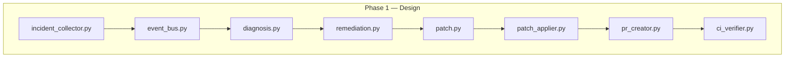

# Designing a Pipeline-Repair Agent Before Writing a Line of Logic

## Hook

I spent most of my time on this project not writing code, but deciding what code should exist. That sounds like a small thing. It isn't. Every file I created was a bet on how a CI/CD failure actually moves through a system, and I made most of those bets before I had any code to prove me right or wrong.

## What We Were Trying to Achieve

The project is a CI/CD Intelligence Agent: a system meant to catch a failing pipeline, figure out why it failed, propose a fix, open a pull request, and check whether the fix actually works. My README says it plainly — we're still in **Phase 1: building the CI/CD test environment.** I'm not going to dress that up as further along than it is.

My part of the system is the repair pipeline: the path from "a build just failed" to "here's a PR that might fix it." That meant defining `incident_collector.py`, `event_bus.py`, `diagnosis.py`, `remediation.py`, `patch.py`, `patch_applier.py`, `pr_creator.py`, `ci_verifier.py`, and the supporting pieces — `github_client.py`, `llm_client.py`, `state_store.py`, `worker.py`, `main.py`, `dashboard.py`.

Member 1 covers the overall system and main workflow. Member 2 covers memory and retrieval. This is the part where a failure gets diagnosed and turned into an actual code change.

## The Problem We Encountered

The real problem wasn't a bug. It was that I had to design a multi-stage, asynchronous repair pipeline — collector, queue, diagnosis, patch generation, patch application, PR creation, verification — as a set of separated modules, before any of them had working logic inside them. That's a specific kind of hard: you're not debugging behavior, you're trying to guess the right seams to cut the system along, and you only find out if you guessed right once real failures start flowing through it.

[ADD ACTUAL DEVELOPMENT CHALLENGE FROM YOUR EXPERIENCE — for example: a specific decision about how incidents should be queued, a disagreement about where diagnosis should happen, or a design change you made after realizing the first split of responsibilities didn't work.]

## What We Tried First

Looking at the dependency list in `requirements.txt`, the initial plan was fairly ambitious for a system still building its test environment:

```
pytest
requests
openai
pydantic
google-genai
kafka-python
streamlit
redis
```

That's an event-driven design: **Kafka** (`kafka-python`) to move incidents between stages, **Redis** for shared state, **pydantic** for validating incident and patch data as it crosses module boundaries, two separate LLM providers (`openai` and `google-genai`) for diagnosis and patch generation, and **Streamlit** for a dashboard to watch it all happen.

The file layout mirrors that plan directly:

```
incident.py            # data model for a CI failure
incident_collector.py  # pulls failures in (likely from GitHub Actions)
event_bus.py           # Kafka-backed message passing between stages
diagnosis.py           # LLM call: "why did this fail?"
remediation.py         # decide what kind of fix to attempt
patch.py               # data model for a proposed code change
patch_applier.py       # apply the patch to a branch
pr_creator.py          # open the PR via GitHub API
ci_verifier.py         # check whether the new pipeline run passes
state_store.py         # Redis-backed state across the pipeline
worker.py / main.py    # process entrypoints
dashboard.py           # Streamlit UI
```

[ADD ACTUAL DEVELOPMENT CHALLENGE FROM YOUR EXPERIENCE — describe what you actually tried to implement first, in what order, and why.]

## Why It Did Not Work

Here's the honest state of the repository right now: every one of those sixteen files exists, but every one of them is empty. Zero bytes. The architecture is real — it's expressed in the file names and the dependencies pulled in — but none of the logic inside `diagnosis.py`, `patch_applier.py`, `ci_verifier.py`, or any other module has been written yet.

[PROBLEM / CODE SCREENSHOT HERE]
Caption: file listing showing all Phase 1 modules present but empty (0 bytes), confirming the project is still in the design/scaffolding stage.

I'm not going to invent a bug I didn't hit, a stack trace I didn't see, or a fix I didn't write. If I pretended otherwise, this section would be fiction. The real story here is that turning a nine-stage architecture diagram into working code is its own project, and Phase 1 is where you find out whether the boundaries you drew on paper survive contact with actual CI failures.

[ADD ACTUAL DEVELOPMENT CHALLENGE FROM YOUR EXPERIENCE — if you had started implementing any of these modules locally and hit a real issue (an API limit, a schema mismatch, a design you had to abandon), this is where it goes.]

## How We Changed the Approach



This diagram is not a before/after of working code — it's the plan as it exists in the file structure today. [ADD REAL BEFORE/AFTER TEST RESULT HERE — once any stage is implemented and tested, replace this diagram with the actual change you made and why.]

## What the Final System Does

Right now: nothing yet, end to end. The scaffolding defines what each stage *will* do — collect a failure, queue it, diagnose it with an LLM, generate a patch, apply it, open a PR, verify the fix — but none of that is runnable. Anyone reading this should know that going in.

[FINAL WORKFLOW / DIAGRAM HERE — once implemented, this is where the real, working pipeline diagram belongs.]

## Real Before vs After Example

[ADD REAL BEFORE/AFTER TEST RESULT HERE — this section needs an actual failing pipeline run, the diagnosis the agent produced, and the resulting PR. That data doesn't exist yet in this repository.]

[BEFORE SCREENSHOT]
Caption: a real failing CI run, once the collector is wired up.

[AFTER SCREENSHOT]
Caption: the PR the agent opened in response, once patch generation and PR creation are implemented.

## Code Behind the Change

There's no code to show yet — every module file is currently empty. The most honest "snippet" I can offer is the shape of the plan itself, visible in `requirements.txt` and the file layout above.

[CODE SNIPPET HERE — once `diagnosis.py`, `patch_applier.py`, or `ci_verifier.py` have real implementations, this is where the clearest before/after or problem/fix snippet from those files goes.]

## Results and Observations

I'm not going to report accuracy numbers, latency, or success rates — there are none, because there's nothing running yet. What I can say, based directly on the repository:

- The project has a clearly defined nine-module architecture for pipeline repair, expressed in file structure.
- The dependency list confirms specific technical choices already made: Kafka for the event bus, Redis for state, pydantic for data validation, dual LLM providers for diagnosis/patching, Streamlit for the dashboard.
- All sixteen implementation files are currently empty (0 bytes) — this is a scaffolding-stage system, not a working one.

## Limitations

- No implementation exists yet in any of the sixteen module files.
- No tests exist (`pytest` is a dependency, but there's no test file in the repository yet).
- No evidence of error handling, retries, or fallback logic, since there's no logic at all yet to handle errors in.
- The choice between `openai` and `google-genai` as LLM providers hasn't been resolved or documented — both are listed as dependencies with no indication of how they're meant to be used together or which one does what.

[ADD ACTUAL PROJECT LIMITATIONS HERE — add anything specific you know from working on this that isn't visible in the empty files.]

## Lessons Learned

1. **A file structure is a hypothesis, not a result.** Naming `diagnosis.py` and `remediation.py` as separate modules is a bet that diagnosis and remediation should be decoupled — that bet isn't tested until there's code inside them.
2. **Dependency lists tell you more than they seem to.** Just from `requirements.txt`, you can reconstruct the intended shape of the system — event-driven, LLM-backed, with a UI — before reading a single line of implementation.
3. **It's tempting to describe a planned system as a working one.** Resisting that is worth it. An honest "this doesn't exist yet" is more useful to teammates than a confident description of behavior nobody has seen.
4. **Naming stages after a repair workflow (collect → diagnose → patch → verify) forces you to think about failure at each boundary early**, even before you've written the code that will actually fail there.

[ADD ACTUAL EXPERIENCE — add any lesson specific to decisions you made that isn't captured above.]

## My Contribution

[ADD YOUR PERSONAL CONTRIBUTION HERE — describe specifically which of the nine modules you scaffolded, which architectural decisions were yours, and what you plan to implement next.]

## What We Would Improve Next

| Current Limitation | Possible Improvement |
|---|---|
| All repair-pipeline modules are empty | Implement `incident_collector.py` and `event_bus.py` first, since every later stage depends on incidents actually flowing through the system |
| No tests exist despite `pytest` being a dependency | Add a minimal test for `incident.py` and `patch.py` data models before building logic on top of them |
| Two LLM providers listed with no defined roles | Decide explicitly whether `diagnosis.py` and `remediation.py` use the same provider or split responsibilities, and document it |
| No verification loop implemented | Build `ci_verifier.py` early enough to close the loop end-to-end on at least one real, reproducible failure case |

## Conclusion

This isn't the article I set out to write. I expected to be describing a bug I hit and a fix I shipped. What I actually have is a repository that's honest about being early — a well-thought-out architecture for a pipeline-repair agent, expressed in file names and dependencies, with no working code behind it yet. I'd rather write that down accurately than invent the rest.

---

## VISUALS I NEED TO ADD

1. **Repository file listing screenshot**
   PLACE AFTER: "Why It Did Not Work"
   SHOW: the `New folder` directory listing with all 16 `.py` files visible at 0 bytes, to make the "nothing implemented yet" claim visually verifiable.

2. **`requirements.txt` screenshot**
   PLACE AFTER: "What We Tried First"
   SHOW: the actual dependency file, to back up the architecture inference.

3. **Before screenshot (once available)**
   PLACE AFTER: "Real Before vs After Example"
   SHOW: a real failing GitHub Actions run once `incident_collector.py` exists.

4. **After screenshot (once available)**
   PLACE AFTER: "Real Before vs After Example"
   SHOW: the PR the agent opens once `pr_creator.py` exists.

5. **Final system screenshot (once available)**
   PLACE AFTER: "What the Final System Does"
   SHOW: the Streamlit dashboard (`dashboard.py`) once it renders real pipeline state.

## CODE SNIPPETS I NEED TO SHOW

None available yet — every module file (`main.py`, `worker.py`, `incident.py`, `incident_collector.py`, `diagnosis.py`, `remediation.py`, `patch.py`, `patch_applier.py`, `pr_creator.py`, `ci_verifier.py`, `github_client.py`, `llm_client.py`, `event_bus.py`, `state_store.py`, `dashboard.py`, `calculator.py`) is currently empty. Once any of them has real logic, pick the smallest snippet that shows a problem → fix and slot it into "Code Behind the Change."

## FINAL ARTICLE CHECKLIST

- [x] Simple human English
- [x] No "hackathon"
- [x] Real engineering situation (design-stage scaffolding), not invented
- [x] No fake benchmarks
- [x] No invented features or code
- [x] No Hindsight content included, per instruction
- [ ] 800–1,500 words — currently a bit under target because there's no implementation to describe in depth; will grow naturally once real code/results are added
- [ ] Before/after example — placeholder only, needs real data
- [ ] Real code snippet — placeholder only, needs real implementation
- [ ] Personal contribution — needs to be filled in by you
- [ ] Screenshots — needs to be captured by you
